# HỆ THỐNG QUẢN LÝ DỰ ÁN SCRUM TÍCH HỢP AI

## Cẩm nang phân tích, thiết kế, phát triển và vận hành

**Nhóm 7 — ba thành viên.** Tài liệu chuẩn tắc của sản phẩm. Các tên kỹ thuật `ProjectMgmt`, `IdentityExperience`, `Planning` và `DeliveryIntelligence` được giữ nguyên khi chỉ tới mã nguồn, cơ sở dữ liệu và hợp đồng phần mềm.

> **Lời hứa với người đọc:** Sau khi đọc Phần I, người không chuyên hiểu hệ thống làm gì. Sau Phần II–IV, thành viên biết mình phải xây dựng gì, ở đâu và giao tiếp với ai. Phần V–VII chỉ đường để kiểm thử, triển khai, bàn giao và tiếp tục phát triển dự án mà không cần đọc lịch sử trò chuyện.

---

# Phần I. Hiểu sản phẩm trước khi viết mã

## 1. Cách dùng quyển cẩm nang

Giảng viên, quản lý và người tiếp nhận dự án đọc Chương 2–4 rồi xem các Hình 1–4 để nắm bài toán, phạm vi và kiến trúc. Thành viên phát triển đọc toàn bộ, đặc biệt Chương 8–15. Người vận hành dùng Chương 16–18. Mỗi thay đổi nghiệp vụ phải cập nhật cùng lúc tiêu chí nghiệm thu, hợp đồng API, kiểm thử và sơ đồ liên quan trong quyển này; không tạo một “bản mới” cạnh tranh với nó.

Các từ **phải** là quy tắc bắt buộc của sản phẩm. Các từ **nên** là lựa chọn ưu tiên và cần ghi lý do nếu làm khác. Ví dụ JSON và chữ ký interface trong sách là hợp đồng thiết kế; vị trí mã nguồn cụ thể phải được xác nhận bằng bộ kiểm thử của phiên bản đang triển khai. Bản thân cẩm nang không phải bảng tiến độ.

## 2. Bài toán và kết quả cần tạo ra

Một nhóm Scrum cần biết yêu cầu nào quan trọng, ai đang làm gì, Sprint có quá tải không và công việc đã hoàn thành đúng quy trình chưa. Khi chỉ dùng bảng công việc rời rạc, Product Owner phải tự tách Story thành việc nhỏ; Scrum Master phân công theo cảm tính; thông tin kỹ năng và tải làm việc không được sử dụng; lịch sử quyết định thất lạc. Sản phẩm này kết nối việc quản lý dự án với hai công cụ AI có kiểm soát.

**Đầu vào:** thành viên và kỹ năng, tổ chức/dự án, User Story, quy trình làm việc, Sprint, năng lực và dữ liệu lịch sử. **Đầu ra:** Backlog có thể lập kế hoạch, bảng công việc có quyền và lịch sử, đề xuất phân rã yêu cầu, đề xuất phân công, báo cáo và dữ liệu phản hồi để cải thiện AI. AI chỉ đề xuất; con người xác nhận trước khi tạo công việc hoặc giao người.

Hệ thống là ứng dụng web nội bộ, không phải phần mềm chấm điểm nhân viên. Một đội nhỏ có thể triển khai bằng một backend ASP.NET Core, một frontend Angular, một MySQL và các tiến trình suy luận AI được kiểm soát. Không cần microservice hóa các module nghiệp vụ.

### 2.1 Phạm vi sản phẩm

| Nhóm năng lực | Người dùng nhìn thấy | Quy tắc cốt lõi |
|---|---|---|
| Danh tính & quyền | Đăng nhập, hồ sơ, kỹ năng, thành viên, quản trị quyền | Mọi thao tác phải kiểm tra quyền ở backend theo phạm vi tổ chức/dự án. |
| Cấu hình dự án | Tổ chức, Project, loại Issue, mức ưu tiên, workflow, board | Project Key duy nhất trong tổ chức; cấu hình mặc định hợp lệ. |
| Scrum | Product Backlog, Sprint Backlog, capacity, vòng đời Sprint | Một Project chỉ có tối đa một Sprint Active. |
| Thực thi | Epic/Story/Task/Bug/Sub-task, trạng thái, thứ tự, bình luận, tệp, lịch sử | Chuyển trạng thái theo workflow; mọi thay đổi quan trọng có dấu vết. |
| AI 1 — Phân rã yêu cầu | Danh sách Sub-task và Acceptance Criteria được đề xuất | Không tự ghi Issue; người dùng xem/sửa/chấp nhận/từ chối. |
| AI 2 — Đề xuất phân công | Danh sách ứng viên, điểm và lý do | Không tự gán người; PM/SM quyết định cuối. |
| Báo cáo & thông báo | Workload, velocity, burndown, inbox, realtime | Dữ liệu báo cáo nhất quán với Issue/Sprint và giới hạn quyền xem. |
| Quản trị dữ liệu AI | Dataset, phiên bản, chất lượng, huấn luyện, đánh giá | DataOps là nền tảng của hai AI, không phải AI thứ ba. |

Ngoài phạm vi lõi: ứng dụng di động native, billing, AI tự ra quyết định nhân sự, tự sinh mã nguồn, chuyển toàn bộ nghiệp vụ thành microservices, bắt buộc triển khai CQRS/Event Sourcing/CRDT hoặc huấn luyện LLM từ đầu. Các kỹ thuật nghiên cứu như QLoRA, RAG, tối ưu Sprint và khai phá quy trình chỉ được bổ sung khi có dữ liệu, năng lực tính toán và thước đo đánh giá phù hợp; không được quảng bá như năng lực cốt lõi mặc định.

## 3. Một ví dụ đi hết hệ thống

Product Owner tạo Story “Người dùng có thể đặt lại mật khẩu”. Story thuộc Project `CRM`, được ưu tiên trong Product Backlog và gắn Acceptance Criteria ban đầu. PO yêu cầu AI 1 gợi ý; AI trả về các Sub-task như tạo endpoint, gửi OTP, xây màn hình, kiểm thử token. PO bỏ một gợi ý trùng, sửa hai tiêu chí rồi bấm **Áp dụng**. Chỉ các mục được duyệt mới trở thành Issue thật, có quan hệ cha–con với Story.

Scrum Master chọn Story và các việc con vào Sprint, xem capacity của từng người. AI 2 xếp hạng ứng viên cho việc “tạo endpoint”: kết quả cho biết điểm kỹ năng, tải, lịch sử và capacity; Scrum Master có thể chọn ứng viên thứ hai và ghi lý do. Developer xử lý Issue trên Board; hệ thống xác thực quyền, kiểm workflow, lưu lịch sử và thông báo người liên quan. Khi Sprint kết thúc, hệ thống chốt snapshot và báo cáo. DataOps lấy phản hồi “gợi ý nào được giữ/sửa/bỏ” cùng quyết định phân công và kết quả thực tế để đánh giá phiên bản mô hình; dữ liệu nhạy cảm phải được loại bỏ trước khi huấn luyện.

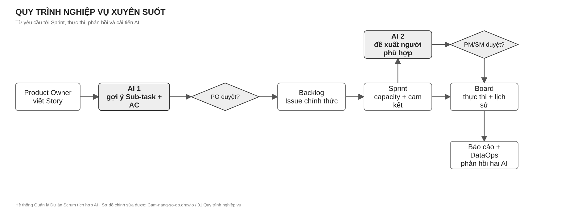

*Cách đọc Hình 1.1:* theo mũi tên từ trái sang phải; các cổng “duyệt” là quyết định của con người, không phải kết quả tự động của AI. Tệp chỉnh sửa: `diagrams/Cam-nang-so-do.drawio`, trang `01 Quy trình nghiệp vụ`.

## 4. Người dùng, quyền và ngôn ngữ chung

| Vai trò | Trách nhiệm | Quyền điển hình |
|---|---|---|
| System Admin | Cấu hình hệ thống, danh tính, quyền, phiên bản AI | Quản trị ở phạm vi hệ thống; không mặc nhiên xem mọi dữ liệu nhạy cảm. |
| Project Manager | Mục tiêu, thành viên, ưu tiên, quyết định nhân sự | Tạo/cấu hình Project, duyệt phân công, xem báo cáo. |
| Scrum Master | Bảo vệ quy trình Sprint, capacity và luồng công việc | Bắt đầu/kết thúc Sprint, điều phối Board, xử lý blocker. |
| Product Owner / Tech Lead | Giá trị nghiệp vụ, Story, tiêu chí nghiệm thu | Quản lý Backlog, duyệt phân rã AI, chấp nhận kết quả. |
| Developer | Thực thi Issue | Xem việc được phép, cập nhật trạng thái, bình luận, phản hồi. |
| Viewer | Theo dõi tiến độ | Chỉ đọc dữ liệu trong phạm vi được cấp. |
| Worker | Xử lý job AI/thông báo | Service identity tối thiểu, không dùng quyền admin người dùng. |

**Project** là không gian quản lý sản phẩm. **Backlog** là danh sách công việc có thứ tự ưu tiên. **Sprint** là một khoảng thời gian làm việc đã cam kết. **Issue** là đơn vị công việc; Epic/Story/Task/Bug/Sub-task là các loại Issue. **Workflow** định nghĩa trạng thái và đường chuyển hợp lệ; **Board** hiển thị Issue theo cột ánh xạ tới trạng thái. **Capacity** là khả năng nhận việc của người trong Sprint. **Acceptance Criteria (AC)** là điều kiện kiểm chứng được để chấp nhận việc. **Contract** là giao diện dữ liệu/hành vi mà module khác có thể dựa vào. **Human-in-the-loop** nghĩa là con người có bước xét duyệt bắt buộc trước tác động nghiệp vụ của AI.

# Phần II. Đặc tả chức năng và quy tắc nghiệp vụ

## 5. Hành trình sử dụng và điều kiện nghiệm thu

### 5.1 Danh tính và quyền

Người dùng đăng ký hoặc được mời, xác minh email/OTP, đăng nhập và nhận access token ngắn hạn cùng refresh token có rotation. Hồ sơ chứa tên hiển thị và kỹ năng; thông tin nhạy cảm không được đưa vào DTO công khai. Quyền được kiểm tra ở backend cho từng hành động và từng Project/Organization, không chỉ bằng cách ẩn nút trên Angular. Khi thu hồi quyền hoặc refresh token, phiên cũ phải không còn hợp lệ theo chính sách bảo mật. Tất cả mật khẩu và OTP được lưu ở dạng băm phù hợp; token không ghi vào log.

**Nghiệm thu:** sai thông tin đăng nhập không tiết lộ tài khoản có tồn tại; người không có quyền nhận 401/403 phù hợp; người thuộc Project A không đọc được dữ liệu Project B; refresh token cũ không được tái sử dụng; thao tác quyền có actor và thời gian.

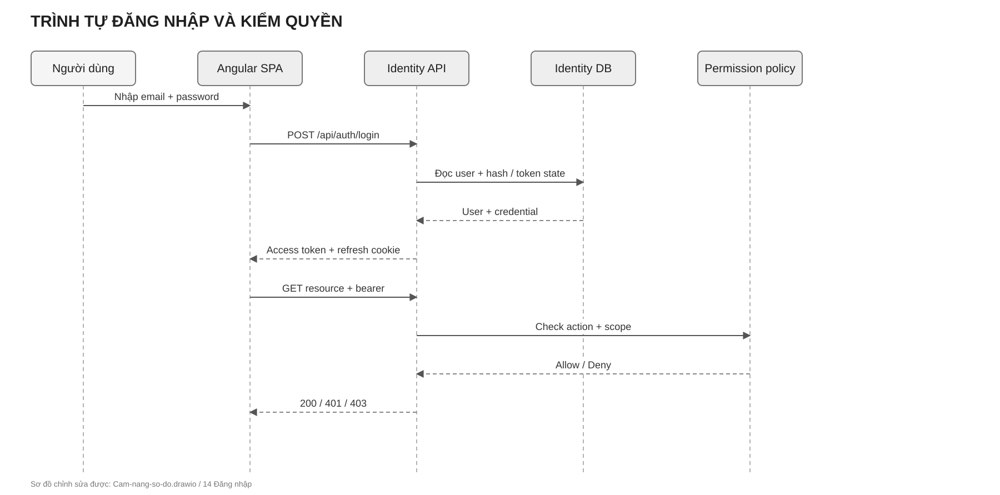

*Cách đọc Hình 5.1:* sau đăng nhập, mỗi request tới tài nguyên vẫn phải qua policy theo action và scope; token hợp lệ không đồng nghĩa được phép xem mọi Project. Tệp chỉnh sửa: `diagrams/Cam-nang-so-do.drawio`, trang `14 Đăng nhập`.

### 5.2 Tổ chức, Project và cấu hình

Project thuộc Organization, có `ProjectKey`, tên, mô tả, người phụ trách, loại Issue, priority, workflow và board. Khi tạo Project, cấu hình mặc định phải được tạo trong cùng transaction của Planning; không để Project ở trạng thái dùng được một nửa. Workflow gồm status và transition; BoardColumn ánh xạ trạng thái, có thứ tự và WIP limit. Không cho xóa status/column khi còn dữ liệu phụ thuộc mà không có kế hoạch chuyển đổi.

**Nghiệm thu:** trùng ProjectKey trong cùng Organization bị từ chối; Project mới tạo có thể lập tức tạo Issue; transition không hợp lệ bị từ chối với lý do; cập nhật cấu hình bảo toàn thứ tự và lịch sử cần thiết.

### 5.3 Backlog, Issue và cộng tác

Issue có Project, loại, tiêu đề, mô tả, priority, status, người phụ trách, rank, parent (nếu là Sub-task), AC, nhãn, component, version, kỹ năng yêu cầu và lịch sử. Số Issue phải được cấp nguyên tử theo Project. Tránh vòng lặp cha–con và tự làm cha. Mỗi thay đổi trạng thái, người phụ trách hoặc thuộc tính quan trọng phải lưu actor, thời điểm và giá trị trước/sau. Tệp đính kèm cần kiểm loại, kích thước, tên lưu trữ và quyền tải; không dùng tên file người dùng làm đường dẫn máy chủ.

**Nghiệm thu:** thao tác lặp do retry không tạo Issue trùng; người dùng không thấy Issue ngoài phạm vi; Board và Issue Detail nhất quán; hai người cập nhật đồng thời phải phát hiện xung đột hoặc có quy tắc hòa giải rõ; lịch sử không bị sửa ngược.

### 5.4 Sprint và báo cáo

Sprint có trạng thái Planned → Active → Completed, ngày, mục tiêu, danh sách Issue và capacity thành viên. Chỉ một Sprint Active trên một Project; luật này phải an toàn trước hai request đồng thời. Khi bắt đầu Sprint, chốt tập Issue và capacity cam kết; khi hoàn thành, chốt snapshot báo cáo, chuyển Issue chưa xong theo lựa chọn được xác nhận. Burndown dùng lịch sử thực thi/snapshot, không suy từ trạng thái cuối cùng. Velocity phải ghi rõ định nghĩa “Done” và Story Point được tính.

**Nghiệm thu:** không thể kích hoạt Sprint thứ hai; không mất Issue khi đóng Sprint; số liệu báo cáo lặp lại được từ snapshot/log; người chỉ xem không thể thay đổi Sprint.

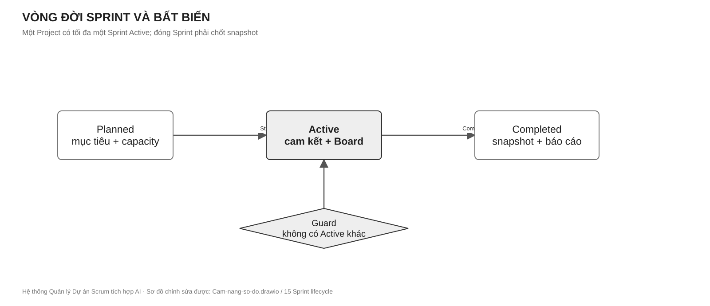

*Cách đọc Hình 5.2:* `Start` chỉ đi qua khi guard “không có Active Sprint khác” được kiểm nguyên tử; `Complete` chốt dữ liệu trước khi báo cáo. Tệp chỉnh sửa: `diagrams/Cam-nang-so-do.drawio`, trang `15 Sprint lifecycle`.

### 5.5 Thông báo

Khi Issue được giao, được nhắc tới, có bình luận hoặc thay đổi quan trọng, module sở hữu sự kiện gửi thông điệp qua `INotificationSender`. IdentityExperience lưu notification và phát realtime nếu người nhận đang kết nối. Phát realtime chỉ là kênh phụ: mất kết nối không được làm mất inbox. Mọi deep-link phải kiểm lại quyền khi người dùng mở.

## 6. Hai AI và vòng đời phản hồi

### 6.1 AI 1 — Phân rã yêu cầu

**Câu hỏi:** “Story này cần những công việc con và tiêu chí nghiệm thu nào?” Input gồm tiêu đề, mô tả, loại Issue, bối cảnh Project và ràng buộc; output là JSON có `schemaVersion`, danh sách `subTasks`, mô tả, AC và gợi ý kỹ năng/ước lượng nếu có. Request được tiếp nhận bất đồng bộ, trả `generationId`; worker suy luận, kiểm JSON Schema, lọc dữ liệu nhạy cảm và lưu kết quả nháp. Người dùng xem, sửa, giữ, bỏ hoặc áp dụng; việc áp dụng đi qua contract của DeliveryIntelligence để tạo Issue thật và phải idempotent.

Kết quả luôn gắn `modelVersion`, `promptVersion`, `generatedAt`, nguồn bối cảnh, trạng thái và hành động cuối. Một gợi ý sai không trở thành Issue chỉ vì worker trả `Completed`. Chất lượng được đo bằng tỷ lệ JSON hợp lệ, tỷ lệ giữ/sửa/bỏ, độ kiểm chứng của AC, trùng lặp, latency và mức độ sửa; không chỉ dựa vào BLEU/ROUGE.

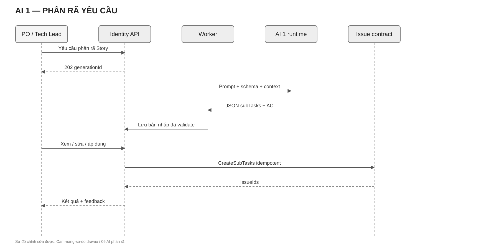

*Cách đọc Hình 6.1:* phần sinh gợi ý dừng ở bản nháp; mũi tên tạo Issue xuất hiện sau hành động **Áp dụng** của PO/Tech Lead. Tệp chỉnh sửa: `diagrams/Cam-nang-so-do.drawio`, trang `09 AI phân rã`.

### 6.2 AI 2 — Đề xuất phân công

**Câu hỏi:** “Ai phù hợp để xử lý Issue và vì sao?” Hệ thống lọc ứng viên theo membership/quyền/khả dụng, chụp các đặc trưng tại thời điểm `asOf`, chuẩn hóa điểm thành phần, rồi xếp hạng. Bản cơ sở giải thích được dùng công thức:

```text
Điểm = 0,40 × cân bằng tải + 0,30 × khớp kỹ năng
     + 0,20 × lịch sử phù hợp + 0,10 × capacity.
```

Trọng số, công thức chuẩn hóa, tập ứng viên, `featureSchemaVersion`, cutoff dữ liệu và chiến lược cold-start phải được version hóa. Không dùng dữ liệu phát sinh sau `asOf` để xếp hạng hoặc huấn luyện. PM/SM có thể chấp nhận, đổi người hoặc từ chối; ghi quyết định, lý do và kết quả sau khi Issue hoàn thành. AI không được tự gán người, không công bố bảng xếp hạng phẩm chất con người. Tỷ lệ đồng ý với PM chỉ đo sự phù hợp với quyết định PM, không chứng minh người được đề xuất là “tốt nhất”; đánh giá kết quả nghiệp vụ phải tách riêng.

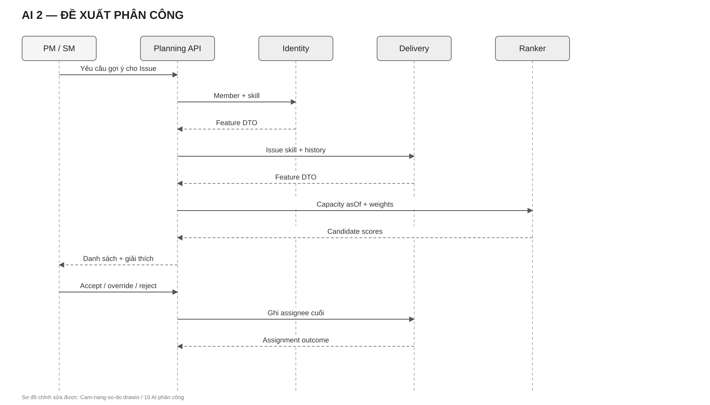

*Cách đọc Hình 6.2:* ô xếp hạng tạo danh sách có lý do; quyết định cuối và việc ghi assignee nằm ở PM/SM qua DeliveryIntelligence. Tệp chỉnh sửa: `diagrams/Cam-nang-so-do.drawio`, trang `10 AI phân công`.

### 6.3 DataOps — nền tảng kiểm soát hai AI

DataOps thu thập phản hồi có quyền, khử PII, làm sạch, deduplicate, gán nhãn, review, chia train/validation/test theo nhóm và thời gian, đóng băng DatasetVersion bằng checksum/seed, ghi TrainingRun, đánh giá trên holdout khóa và chỉ kích hoạt ModelVersion sau gate. Không chỉnh mẫu đã freeze; muốn sửa phải tạo phiên bản dữ liệu mới. Không “tự học liên tục” trực tiếp từ mỗi click của người dùng. Với RAG, bắt buộc lọc theo Project/quyền, lưu phiên bản index và provenance. Với QLoRA/fine-tuning, phải có baseline, tập dữ liệu đủ chất lượng, ngân sách máy và kế hoạch rollback.

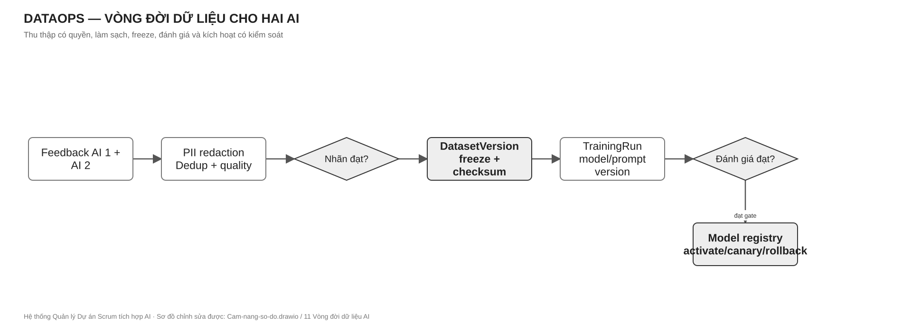

*Cách đọc Hình 6.3:* mỗi vòng huấn luyện dùng một DatasetVersion bất biến; mũi tên quay lại thu thập chỉ bắt đầu một phiên bản mới. Tệp chỉnh sửa: `diagrams/Cam-nang-so-do.drawio`, trang `11 Vòng đời dữ liệu AI`.

## 7. Quy tắc phi chức năng

**Bảo mật:** TLS ngoài máy phát triển; secret ở User Secrets hoặc secret store/ACL, không trong Git; rate limit login/OTP/AI; object-level authorization; validate đầu vào và tệp; chống cross-project data leak; log không chứa token/PII thô. **Độ tin cậy:** command có thể retry phải có idempotency key hoặc khóa duy nhất; job AI có timeout, retry có backoff, trạng thái lỗi và thao tác thử lại; notification gửi sau commit. **Hiệu năng:** phân trang Issue/Activity/Notification; index theo query thật và `EXPLAIN`; tránh N+1; báo cáo nặng dùng snapshot/read model. **Quan sát:** correlation ID đi qua HTTP, job, AI và notification; log có project/issue ID đã kiểm soát; health/live không thay thế readiness DB và smoke nghiệp vụ.

# Phần III. Kiến trúc có thể triển khai và bảo trì

## 8. Hai cấp kiến trúc: Modular Monolith và Clean Architecture

Hai khái niệm không cạnh tranh nhau. **Modular Monolith** quy định cách chia toàn bộ backend thành ba vùng nghiệp vụ cùng triển khai trong một Host; **Clean Architecture** quy định chiều phụ thuộc và vị trí của mã bên trong từng module. Frontend Angular là ứng dụng riêng ở tầng giao diện; MySQL là một cơ sở dữ liệu vật lý nhưng quyền sở hữu bảng vẫn tách theo module. Dịch vụ suy luận AI có thể chạy như tiến trình riêng để cô lập tải, nhưng không biến các module nghiệp vụ .NET thành microservices.

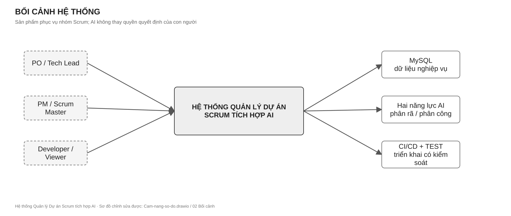

*Cách đọc Hình 8.1:* hộp ở giữa là sản phẩm; tác nhân nằm ngoài; đường liên kết cho biết ai hoặc hệ thống nào trao đổi dữ liệu. Tệp chỉnh sửa: `diagrams/Cam-nang-so-do.drawio`, trang `02 Bối cảnh`.

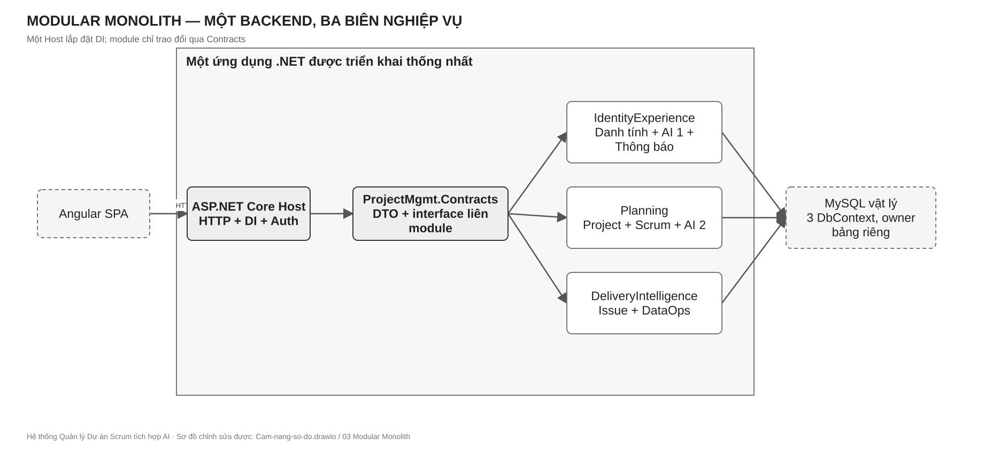

*Cách đọc Hình 8.2:* đường viền lớn là một backend triển khai; ba hộp trong nó là biên sở hữu nghiệp vụ. Mũi tên liên module đi qua Contracts, không đi vào database của nhau. Tệp chỉnh sửa: `diagrams/Cam-nang-so-do.drawio`, trang `03 Modular Monolith`.

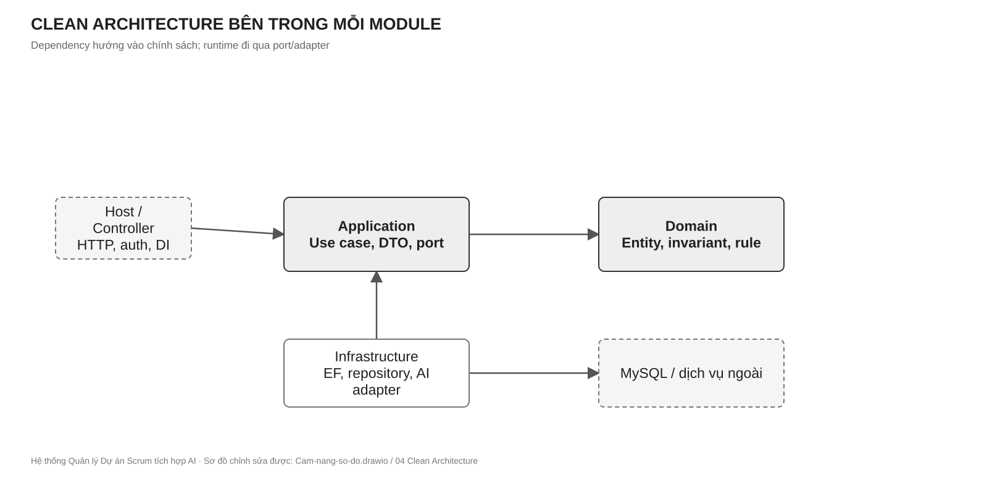

*Cách đọc Hình 8.3:* mũi tên dependency hướng vào Domain/Application. Infrastructure triển khai port của Application; Host lắp đặt DI. Tệp chỉnh sửa: `diagrams/Cam-nang-so-do.drawio`, trang `04 Clean Architecture`.

### 8.1 Các lớp và quy tắc phụ thuộc

| Lớp | Chứa | Không chứa |
|---|---|---|
| Domain | Entity, Value Object, invariant, domain service, repository abstraction khi thuộc nghiệp vụ | EF mapping, HTTP, JSON của provider AI, UI. |
| Application | Use case/service, validation, DTO, port/interface, transaction orchestration | SQL, `DbContext` cụ thể, logic trình bày HTML. |
| Infrastructure | EF Core context/config/repository, adapter AI, storage, notification transport | Quyết định nghiệp vụ độc lập với Application/Domain. |
| Host/Presentation | Controller, middleware, authentication scheme, DI, OpenAPI, health | SQL nghiệp vụ, bypass use case. |
| Contracts | DTO/interface công bố giữa module | EF Entity, `IQueryable`, concrete repository, secret. |
| Core | Result/error, clock, ID/correlation hoặc primitive dùng chung thật sự | “Thùng rác” nghiệp vụ của mọi module. |

Domain không tham chiếu Application/Infrastructure/Host. Application tham chiếu Domain. Infrastructure phụ thuộc Application/Domain để triển khai port. Host phụ thuộc các assembly cần lắp đặt. Module A không tham chiếu trực tiếp Infrastructure/DbContext của B/C. Giao tiếp liên module dùng `ProjectMgmt.Contracts` và interface được DI tại Host. Không áp CQRS/Event Sourcing chỉ vì tài liệu nghiên cứu từng nêu; service/repository truyền thống là nền triển khai, còn event sau commit dùng cho tích hợp khi thật sự cần.

### 8.2 Ánh xạ mã nguồn

```text
ProjectMgmt.slnx
├─ ProjectMgmt.Contracts/             hợp đồng liên module và Result
├─ ProjectMgmt.Core/                  primitive kỹ thuật dùng chung
├─ ProjectMgmt.Modules.IdentityExperience/
│  ├─ Domain/  ├─ Application/  └─ Infrastructure/
├─ ProjectMgmt.Modules.Planning/
│  ├─ Domain/  ├─ Application/  └─ Infrastructure/
├─ ProjectMgmt.Modules.DeliveryIntelligence/
│  ├─ Domain/  ├─ Application/  └─ Infrastructure/
├─ ProjectMgmt.Solution/              ASP.NET Core Host, Controller, DI
├─ ProjectMgmt.Tests/                 một project kiểm thử backend
└─ frontend/projectmgmt-web/         Angular SPA
```

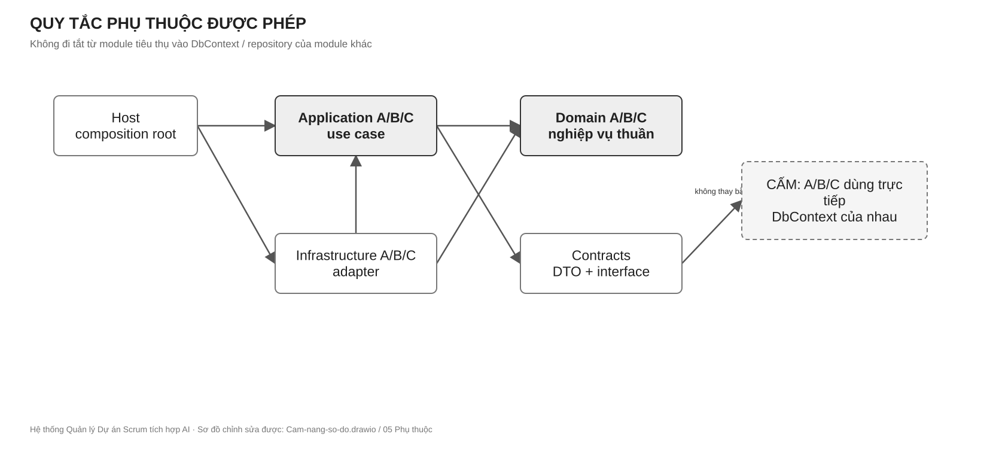

*Cách đọc Hình 8.4:* nét liền biểu thị phụ thuộc được phép; hộp CẤM bên phải mô tả `DbContext`/repository xuyên module. Tệp chỉnh sửa: `diagrams/Cam-nang-so-do.drawio`, trang `05 Phụ thuộc`.

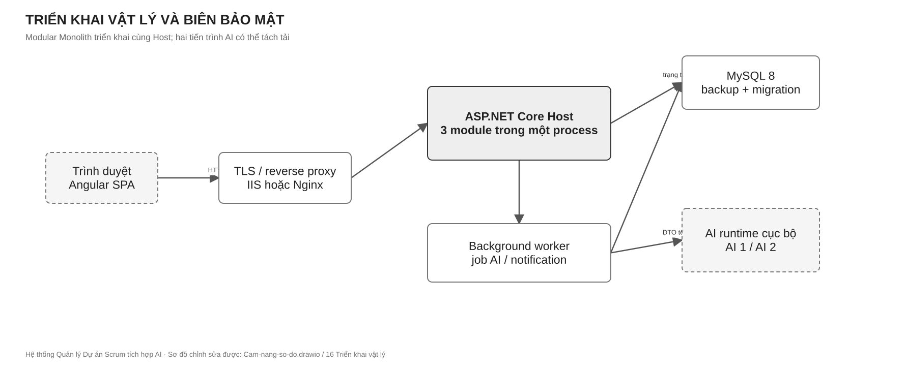

*Cách đọc Hình 8.5:* trình duyệt giao tiếp với một Host chứa ba module; MySQL và AI runtime là phụ thuộc ngoài process. Worker xử lý tác vụ chậm để request HTTP không bị giữ lâu. Tệp chỉnh sửa: `diagrams/Cam-nang-so-do.drawio`, trang `16 Triển khai vật lý`.

## 9. Quyền sở hữu của ba module

### 9.1 IdentityExperience — người dùng và trải nghiệm

Sở hữu User, profile, skill, đăng nhập/OTP/token, role/permission theo scope, thông báo, quản trị prompt/model dùng cho AI Breakdown và vòng đời gợi ý phân rã. Cung cấp `IUserLookupService`, `IUserSkillService`, `IPermissionEvaluator`, `INotificationSender` và khả năng yêu cầu/phê duyệt Breakdown. Không ghi Issue, Project hoặc Sprint trực tiếp.

### 9.2 Planning — không gian dự án và quyết định kế hoạch

Sở hữu Organization, Project, component/version, WorkflowStatus/Transition, IssueType/Priority, Board/Column, Sprint/capacity/snapshot, dữ liệu xếp hạng AI Assignment. Cung cấp `IProjectLookupService`, `IWorkflowValidationService`, `IIssueNumberGenerator` và các use case Sprint/Assignment. Không sửa Issue hoặc User bằng DbContext của module khác.

### 9.3 DeliveryIntelligence — thực thi và trí tuệ dữ liệu

Sở hữu Issue/hierarchy/link, AC, comment/attachment/watcher/label, status/assignment/activity history; dataset, sample, cleaning rule, training/evaluation metadata. Cung cấp `IIssueService`, `IIssueReadService`, `IIssueSprintService`, `IIssueSkillService` và luồng export feedback cho DataOps. Không quyết định quyền hay workflow bằng bản sao logic tự viết; gọi contract sở hữu tương ứng.

**Biên đặc biệt của AI Core:** `AiPromptTemplate` và `AiModel` cùng nằm trong `IdentityExperienceDbContext` để bảo toàn ràng buộc dữ liệu và một chủ migration. A là chủ file mapping/migration của hai bảng và vận hành prompt; C là chủ vòng đời nghiên cứu, đánh giá và đề xuất kích hoạt model. C không tự sửa migration IdentityExperience: thay đổi schema/model registry được mô tả bằng contract + ADR, A tạo migration và A/C cùng review. B chỉ tiêu thụ phiên bản model/ranker đã công bố. Quy tắc này phân biệt rõ **chủ schema vật lý** với **chủ nghiệp vụ vòng đời mô hình**, tránh hai người cùng sửa một snapshot EF.

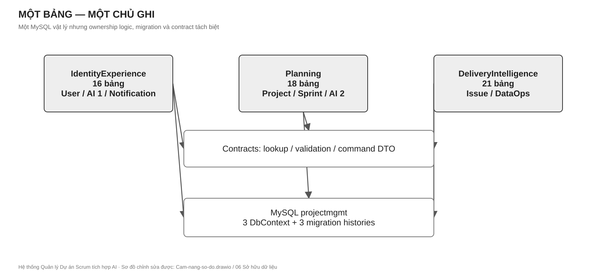

*Cách đọc Hình 9.1:* một bảng chỉ có một chủ ghi; đường liên module là DTO/contract. Báo cáo đọc tổng hợp là ngoại lệ read-only, không tạo quyền ghi chéo. Tệp chỉnh sửa: `diagrams/Cam-nang-so-do.drawio`, trang `06 Sở hữu dữ liệu`.

### 9.4 Quy tắc giải quyết một tính năng chạm nhiều module

Người khởi phát use case là orchestrator; chủ dữ liệu giữ invariant của mình. Ví dụ “AI 1 tạo Sub-task”: IdentityExperience sở hữu generation/review, nhưng DeliveryIntelligence tạo Issue thật qua `IIssueService`; Planning cấp số Issue và kiểm Project/workflow qua contract. Không module nào lấy `DbContext` của hai module kia để tạo một transaction xuyên ranh giới. Nếu một bước sau commit lỗi, job lưu trạng thái và retry idempotent; tác vụ cần tính nguyên tử mạnh phải được thiết kế lại biên giao dịch hoặc dùng outbox.

## 10. Hợp đồng API và tích hợp

### 10.1 Quy tắc API chung

REST dùng URL danh từ số nhiều, JSON UTF-8, UTC ISO 8601 và `Guid` ổn định. GET không đổi trạng thái. POST tạo mới trả 201/Location; job AI trả 202 và resource ID; validation trả 400; chưa đăng nhập 401; thiếu quyền 403; không thấy resource 404; xung đột phiên bản/quy tắc 409. Lỗi nên theo ProblemDetails với `code`, `traceId` và field errors, không lộ stack trace. Danh sách dài phải phân trang, filter và sort xác định. Command có thể retry phải nhận idempotency key. Swagger/OpenAPI được cập nhật cùng API.

### 10.2 Hợp đồng liên module tối thiểu

| Provider | Contract cần duy trì | Consumer | Tính bất biến |
|---|---|---|---|
| IdentityExperience | `IUserLookupService`, `IUserSkillService` | Planning, Delivery | Chỉ DTO/feature có quyền; không trả EF entity. |
| IdentityExperience | `IPermissionEvaluator`, `ICurrentUserContext` | Host và mọi use case | Quyền theo action + resource scope. |
| IdentityExperience | `INotificationSender` | Planning, Delivery | Lưu bền trước realtime; idempotent. |
| Planning | `IProjectLookupService` | Delivery | Kiểm Project, key, cấu hình mà không query DB chéo. |
| Planning | `IWorkflowValidationService` | Delivery | Kiểm transition tại thời điểm command. |
| Planning | `IIssueNumberGenerator` | Delivery | Cấp số duy nhất, an toàn đồng thời. |
| DeliveryIntelligence | `IIssueService` | AI Breakdown | Tạo Sub-task sau duyệt, idempotent. |
| DeliveryIntelligence | `IIssueReadService`, `IIssueSprintService`, `IIssueSkillService` | Planning/AI | Đọc/move theo DTO, không expose `IQueryable`. |

Mỗi method async nhận `CancellationToken`; DTO định nghĩa unit/timezone và version; lỗi nghiệp vụ trả `Result<T>`/error code ổn định. Consumer dùng fake contract để phát triển song song; provider có contract test. Breaking change đòi hỏi cập nhật đồng thời producer, consumer, OpenAPI, test và cẩm nang. Không dùng “shared” để che phụ thuộc vòng.

### 10.3 Danh mục API cần bao phủ

| Nhóm | Các hành động bắt buộc | Owner |
|---|---|
| Auth/RBAC/Profile | register/login/refresh/logout/me, OTP, scoped role, profile, skill | A |
| Organization/Project | list/get/create/update, member, component/version | B |
| Workflow/Board | status/transition, board column, WIP, reorder | B |
| Sprint/Backlog | create/start/complete, capacity, move Issue, snapshot/report | B phối hợp C |
| Issue/Collaboration | CRUD, hierarchy, transition, assignment, comment, attachment, history | C |
| AI Breakdown | request/status/result/edit/apply/reject/feedback | A phối hợp C |
| AI Assignment | request/candidate/decision/outcome/feedback | B phối hợp A/C |
| Notification | inbox, unread count, mark read, realtime | A |
| DataOps | dataset/version/sample/rule/flag/freeze/export/train/evaluate | C |

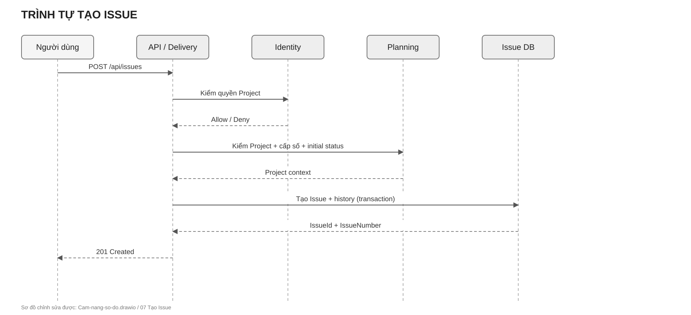

*Cách đọc Hình 10.1:* controller không ghi SQL; Delivery gọi Planning để xác minh Project, cấp số và kiểm trạng thái rồi ghi Issue trong phạm vi sở hữu. Tệp chỉnh sửa: `diagrams/Cam-nang-so-do.drawio`, trang `07 Tạo Issue`.

## 11. Thiết kế dữ liệu

Một MySQL vật lý `projectmgmt` chứa 55 bảng nghiệp vụ, bốn view báo cáo và hai trigger bảo vệ quan hệ cha–con Issue. Ba `DbContext` tương ứng ba module có lịch sử migration riêng. Bảng thuộc module nào chỉ module đó được ghi. Các khóa `XMOD` là GUID tham chiếu logic sang module khác: kiểm tồn tại/quyền qua contract, không tạo FK vật lý xuyên module. Index được quyết định theo query và `EXPLAIN`, không máy móc thêm một index cho mọi cột. Bốn view báo cáo có thể đọc kết hợp xuyên module nhưng read-only; không dùng chúng để thực thi command hoặc kiểm quyền.

| Chủ dữ liệu | Nhóm bảng | Ví dụ quy tắc |
|---|---|---|
| IdentityExperience — 16 | User, UserProfile, ExternalLogin, OtpCode, RefreshToken, Role, Permission, RolePermission, UserRole, SkillCatalog, UserSkill, AiModel, AiPromptTemplate, AiGenerationLog, AiSuggestedTask, Notification | Email chuẩn hóa duy nhất; token rotation; gợi ý AI chỉ là nháp. |
| Planning — 18 | Organization, Project, ProjectComponent, ProjectVersion, WorkflowStatus, WorkflowTransition, IssueType, Priority, Board, BoardColumn, Sprint, SprintSnapshot, SprintMemberCapacity, UserWorkloadSnapshot, UserPerformanceMetric, AiAssignmentRun, AiAssignmentCandidate, AiAssignmentDecision | Một Active Sprint; snapshot feature bất biến; project key duy nhất theo org. |
| DeliveryIntelligence — 21 | Issue, IssueLink, IssueWatcher, Comment, Attachment, ActivityLog, IssueStatusHistory, IssueAssignmentHistory, Label, IssueLabel, IssueComponentLink, IssueVersionLink, IssueRequiredSkill, AcceptanceCriteria, AiDataset, AiDatasetVersion, AiDatasetSample, AiDataCleaningRule, AiDataQualityFlag, AiTrainingRun, AiEvaluationResult | IssueNumber duy nhất theo Project; dataset version đã freeze không sửa. |

`AiModel` là trường hợp cần nhớ: bảng/migration do A giữ trong IdentityExperience; nội dung đánh giá, nguồn TrainingRun và quyết định phát hành model do C chuẩn bị. Không tạo thêm DbContext thứ tư chỉ để giải quyết việc cùng dùng bảng này.

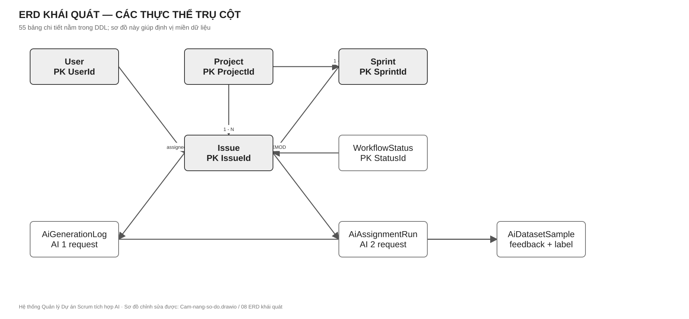

*Cách đọc Hình 11.1:* chỉ các thực thể trụ cột được vẽ để người đọc hiểu dữ liệu; đường ghi `XMOD` là tham chiếu logic, không phải FK vật lý. Danh mục đủ 55 bảng ở bảng trên và DDL tham khảo tại `docs/projectmgmt_schema_mysql_optimized.sql`. Tệp chỉnh sửa: `diagrams/Cam-nang-so-do.drawio`, trang `08 ERD khái quát`.

Ba hình tiếp theo là bản đồ quan hệ đủ **55 bảng**, chia theo chủ dữ liệu để đọc được. Mỗi hộp cho biết PK, tối đa ba FK vật lý, các cột XMOD nổi bật và tổng số cột; đường nối biểu diễn FK vật lý. Mọi cột, kiểu dữ liệu, chỉ mục và ràng buộc còn lại được tra trong DDL. Cùng một bảng có thể xuất hiện thêm dưới dạng hộp tham chiếu ở hình khác, nhưng chỉ có một chủ ghi.

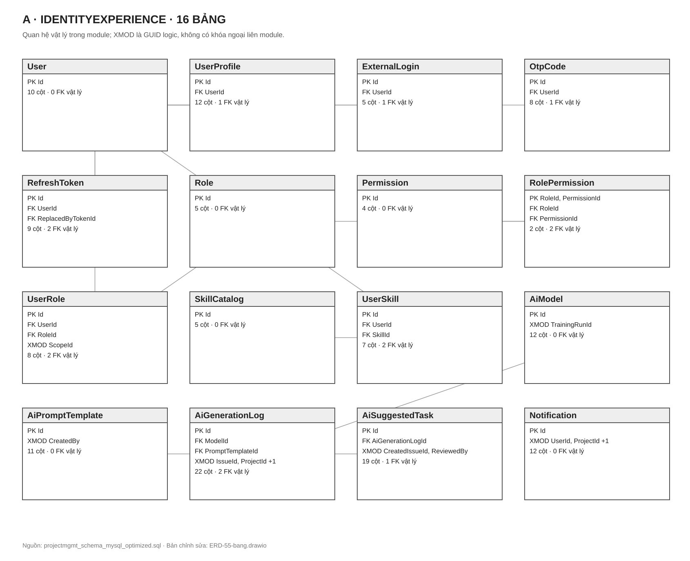

*Cách đọc Hình 11.2:* A sở hữu dữ liệu danh tính, quyền, kỹ năng, AI 1 và thông báo. `AiModel` cùng `AiPromptTemplate` do A sở hữu schema; C cung cấp kết quả đánh giá để duyệt phiên bản. Tệp chỉnh sửa: `diagrams/ERD-55-bang.drawio`, trang `ERD A`.

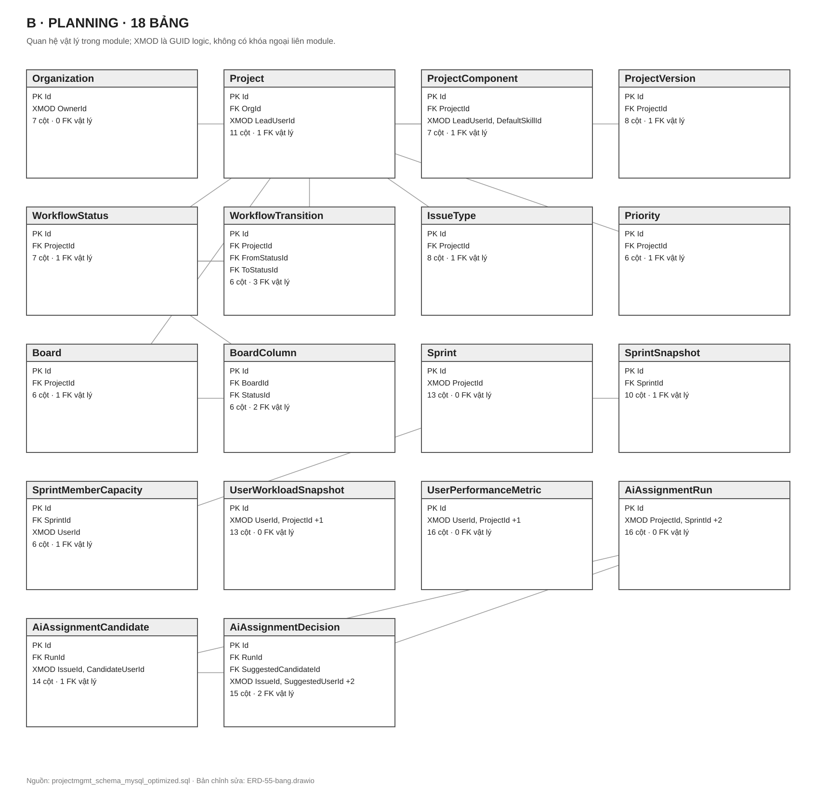

*Cách đọc Hình 11.3:* B sở hữu Project, Workflow, Sprint, Board và toàn bộ dấu vết đề xuất phân công AI 2. Liên kết sang User/Issue dùng XMOD và contract, không tạo FK sang A/C. Tệp chỉnh sửa: `diagrams/ERD-55-bang.drawio`, trang `ERD B`.

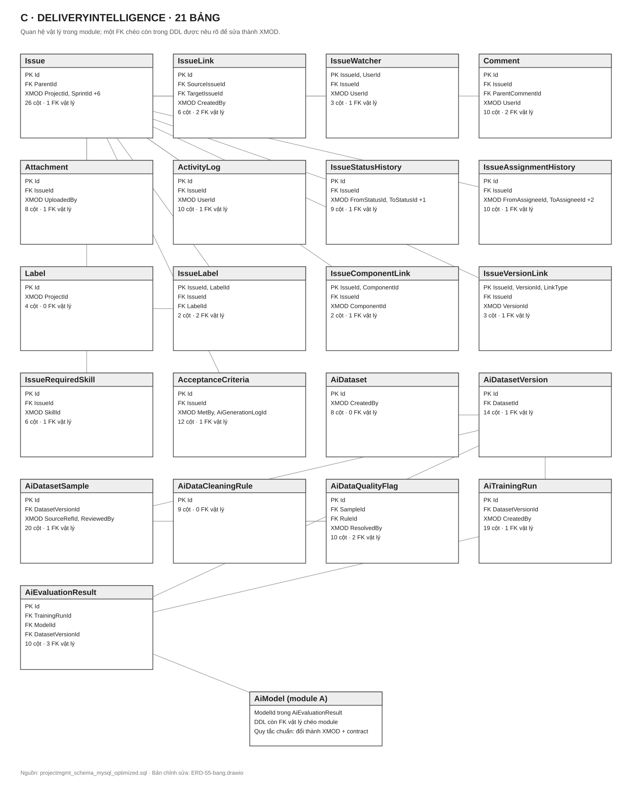

*Cách đọc Hình 11.4:* C sở hữu Issue, lịch sử, dataset, training và evaluation. Hộp `AiModel (module A)` là tham chiếu để cảnh báo: DDL v3.1 có FK vật lý `AiEvaluationResult.ModelId → AiModel.Id`, trái quy tắc không FK xuyên module. Khi triển khai schema chuẩn, giữ `ModelId` và index nhưng bỏ FK này, kiểm tồn tại qua contract của A; cần migration được A/C cùng review. Tệp chỉnh sửa: `diagrams/ERD-55-bang.drawio`, trang `ERD C`.

**Quy trình thay đổi schema:** (1) xác định owner; (2) sửa entity/configuration/migration của context đó; (3) review backward compatibility và query/index; (4) tạo script idempotent; (5) chạy trên DB cô lập, backup/restore rehearsal ở TEST; (6) triển khai có smoke và phương án phục hồi. Không dùng `EnsureCreated`, `EnsureDeleted` hoặc tự `Migrate()` khi app khởi động. File init SQL có lệnh hủy DB chỉ dành cho volume Docker mới, cô lập; không chạy thủ công vào DB có dữ liệu.

## 12. Frontend và luồng dữ liệu

Angular SPA tổ chức theo feature nhưng chia sẻ một `core` cho HTTP/auth/config và `shared` cho component thật sự dùng chung. Route có auth guard và permission guard để hỗ trợ UX; backend vẫn là nơi thực thi quyền. Màn hình phải biểu diễn trạng thái loading, empty, error, success và conflict. Form dùng validation rõ; lỗi API hiển thị theo field hoặc thông báo dễ hiểu, không nuốt lỗi. Không dùng dữ liệu mock để kết luận tính năng đã chạy đầu–cuối. Project, Backlog, Board, Issue Detail và hai AI phải gọi API tương ứng qua service; component không ghép URL hoặc giữ token thô tùy tiện.

**Đường đi của dữ liệu:** thao tác người dùng → Angular service → HTTP interceptor → controller → Application use case → Domain rule → repository/adapter → MySQL/AI → DTO/ProblemDetails → UI state. Realtime cập nhật nhanh nhưng sau reconnect phải đọc lại dữ liệu chính thức từ API. Khi hai người sửa cùng một đối tượng, UI phải hiển thị xung đột và cho nạp lại/so sánh; không âm thầm ghi đè.

# Phần IV. Ba người cùng làm nhưng không giẫm lên nhau

## 13. Ranh giới công việc và quyền quyết định

Chữ A/B/C dưới đây là **vai trò sở hữu lâu dài**, không phải trạng thái công việc của một Sprint. Người tiếp quản vị trí kế thừa phạm vi này. Mọi thành viên chịu trách nhiệm end-to-end trong module của mình: Domain, Application, Infrastructure, API và màn hình tương ứng. Host/Contracts/Core là vùng phối hợp qua review, không phải nơi một người âm thầm đổi giao diện của người khác.

| Vai trò | Thành viên | Module sở hữu | Người review bắt buộc khi đổi contract |
|---|---|---|---|
| A | Trần Văn Hoàng | IdentityExperience | B/C theo consumer bị ảnh hưởng |
| B | Nguyễn Thế Hoài | Planning | A/C theo consumer bị ảnh hưởng |
| C | Hoàng Trần Huy Hoàng | DeliveryIntelligence | A/B theo consumer bị ảnh hưởng |

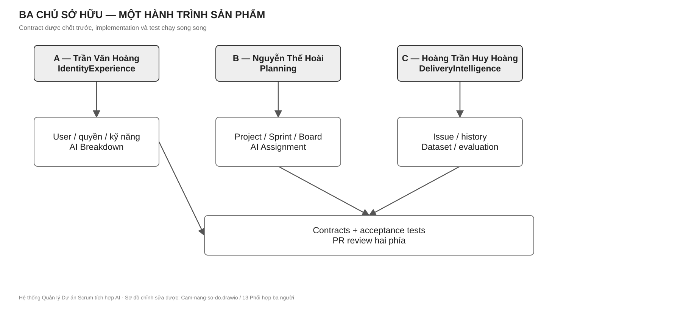

*Cách đọc Hình 13.1:* mỗi làn là một owner; đường chuyển là contract bàn giao; các làn làm song song sau khi chốt DTO. Tệp chỉnh sửa: `diagrams/Cam-nang-so-do.drawio`, trang `13 Phối hợp ba người`.

### 13.1 Vai trò A — IdentityExperience

**Xây dựng:** đăng ký/đăng nhập/OTP/token, hồ sơ và kỹ năng, quyền theo scope, thông báo bền + realtime, AI Breakdown từ request đến review/apply/feedback, màn hình auth/profile/admin/notification/AI governance. **Sở hữu:** 16 bảng IdentityExperience và migration context này; `ProjectMgmt.Modules.IdentityExperience/*`; controller/auth frontend liên quan. **Cung cấp:** user/skill/permission/notification contract cho B/C; breakdown feedback cho C. **Nhận:** `IIssueService` từ C để áp dụng gợi ý, project/workflow context từ B, dataset/model governance metadata từ C theo hợp đồng. **Không làm:** ghi `Issue`/`Project` bằng DbContext khác, dùng default admin hoặc mock token như auth thật, đưa secret vào prompt/log.

**Bàn giao kiểm được:** OpenAPI auth/profile/permission/notification/breakdown; unit test token/OTP/scope; contract test lookup; integration test cross-project denial; một hành trình UI login → request breakdown → review → apply; hướng dẫn cấu hình provider AI và rollback prompt/model.

| Gói việc | Thực hiện cụ thể | Bằng chứng hoàn thành |
|---|---|---|
| A1 — Danh tính | Entity/config cho User, Profile, ExternalLogin, OTP, RefreshToken; email chuẩn hóa, password hash, OTP có TTL/attempt, refresh rotation và reuse detection. | Test đăng nhập sai, OTP hết hạn, concurrent refresh, thu hồi token family. |
| A2 — Quyền | Role/Permission/UserRole theo scope; policy/handler ở Host; permission code dùng cho API của B/C; kiểm object-level Project. | Test 401/403/cross-project và thu hồi quyền; OpenAPI có security scheme. |
| A3 — Hồ sơ/kỹ năng | Profile, SkillCatalog/UserSkill, lookup/skill DTO cho B/C; chính sách xác nhận kỹ năng. | Contract test `IUserLookupService`/`IUserSkillService`; màn hình profile dùng API. |
| A4 — Thông báo | Inbox persistence, unread/mark-read, SignalR group có xác thực, `INotificationSender`; deep-link theo entity. | Mất realtime vẫn còn inbox; người ngoài Project không subscribe được. |
| A5 — AI 1 | PromptTemplate/version, generation log, job async, JSON Schema, preview/edit/reject/apply qua `IIssueService`, feedback; giới hạn tải và dữ liệu nhạy cảm. | Sub-task chỉ xuất hiện sau apply; retry không trùng; model/prompt version truy vết được. |

### 13.2 Vai trò B — Planning

**Xây dựng:** Organization/Project/default config, workflow/board/WIP, Backlog/Sprint/capacity/snapshot/report, AI Assignment từ feature snapshot đến candidate/decision/outcome, giao diện project/settings/backlog/board/roadmap/reports. **Sở hữu:** 18 bảng Planning, migration context này, `ProjectMgmt.Modules.Planning/*`. **Cung cấp:** project lookup, workflow validation, issue number, sprint/assignment use case. **Nhận:** user/skill/quyền từ A; Issue/skill/outcome DTO từ C. **Không làm:** SQL join command sang User/Issue, tự gán người không qua quyết định PM/SM, tính lịch sử sau thời điểm `asOf` để huấn luyện.

**Bàn giao kiểm được:** OpenAPI project/workflow/board/sprint/assignment; unit test transition, one-active-sprint, scoring và cold-start; integration test cấp số/concurrency; UI Project → Backlog → Sprint → Board → review assignment; tài liệu công thức điểm và version.

| Gói việc | Thực hiện cụ thể | Bằng chứng hoàn thành |
|---|---|---|
| B1 — Project | Organization/Project, ProjectKey, component/version, default workflow/board trong transaction, project lookup và cấp IssueNumber nguyên tử. | Tạo Project dùng ngay; trùng key/cấp số đồng thời được xử lý. |
| B2 — Workflow/Board | Status, transition, IssueType, Priority, BoardColumn, WIP; validator nhận quyền và trạng thái nguồn/đích, trả lý do từ chối. | Issue sai transition bị chặn; đổi cấu hình không để cột mồ côi. |
| B3 — Sprint/Backlog | Planned/Active/Completed, capacity, move Issue qua contract C, snapshot cho report; một Active Sprint ở cả DB và use case. | Test hai request Start đồng thời; close Sprint không mất Issue. |
| B4 — AI 2 | Workload/performance snapshot, feature cutoff, filter candidate, weighted ranker versioned, explanation, accept/override/reject, outcome. | Rank tái lập; cold-start có quy tắc; không dùng dữ liệu sau `asOf`. |
| B5 — Giao diện kế hoạch | Project/settings, Backlog, Board, Sprint và báo cáo; trạng thái tải/lỗi/xung đột; AI review hiển thị score component. | Một hành trình Project → Sprint → Board → quyết định phân công qua API thật. |

### 13.3 Vai trò C — DeliveryIntelligence

**Xây dựng:** Issue/hierarchy/AC, chuyển trạng thái, thứ tự, assignment/history, comment/attachment/watcher/label, read contracts cho A/B, dataset/version/sample/rule/quality/training/evaluation, giao diện Issue Detail/DataOps. **Sở hữu:** 21 bảng DeliveryIntelligence, bốn view báo cáo, migration context này, `ProjectMgmt.Modules.DeliveryIntelligence/*`. **Cung cấp:** create/read/move/skill Issue và feedback export. **Nhận:** permission/user từ A; Project/workflow/issue number từ B; generation/assignment feedback từ A/B. **Không làm:** đọc DbContext A/B, sửa dataset version đã freeze, huấn luyện model trong request HTTP, lưu PII thô không kiểm soát.

**Bàn giao kiểm được:** OpenAPI Issue/Collaboration/DataOps; unit test hierarchy/transition/freeze; integration test transaction/history/attachment security; UI tạo Issue → xử lý → xem timeline; xuất dataset tái lập có checksum, seed và metric.

| Gói việc | Thực hiện cụ thể | Bằng chứng hoàn thành |
|---|---|---|
| C1 — Issue lõi | IssueNumber qua B, hierarchy/parent, rank, CRUD, permission qua A, transaction tạo và history; `IIssueService`/`IIssueReadService`. | Tạo đồng thời không trùng mã; cây Issue hợp lệ; consumer A/B dùng fake rồi ghép thật. |
| C2 — Luồng thực thi | Transition qua validator B, assignment/status history, activity log, optimistic concurrency, contract move Sprint/required skill. | Board đúng luật; lịch sử đủ actor/time/old/new; conflict rõ ràng. |
| C3 — Cộng tác | Comment, watcher, label, AC, component/version link, attachment có kiểm loại/kích thước/quyền. | Deep-link và notification đúng người; tải tệp không vượt scope. |
| C4 — DataOps | Dataset/version/sample, PII redaction, dedup, quality flag, freeze/checksum/split seed/export JSONL, training/evaluation metadata. | Frozen version bất biến; không mẫu Approved còn PII; export tái lập. |
| C5 — Vòng đời model | Định nghĩa baseline/holdout/metric, run huấn luyện ngoài web process, đề xuất activation/rollback model; phối hợp A về `AiModel` schema. | Báo cáo so sánh cùng tập test, có model artifact/version/provenance. |

## 14. Cơ chế hợp tác và phát triển song song

1. **Chốt contract trước code:** owner viết DTO, method, ví dụ request/response, lỗi và acceptance test; consumer review trong cùng PR. Tên interface không có nghĩa tính năng đã hoàn thành; test contract mới xác nhận hành vi.
2. **Consumer dùng fake:** A có thể xây review AI với fake `IIssueService`; B xây board với fake `IIssueReadService`; C xây Issue với fake lookup/workflow. Fake trả dữ liệu cố định và lỗi đại diện, không trở thành production provider.
3. **Một owner cho mỗi migration:** không hai người sửa cùng DbContext/snapshot. Đổi bảng chung phải có ADR và chủ sở hữu rõ; không tạo bảng “shared” tùy tiện.
4. **Tích hợp liên tục:** sau mỗi contract ổn định, ghép một vertical slice nhỏ; không chờ hoàn thiện ba module rồi mới nối. PR nhỏ, một outcome, có test và demo.
5. **Mọi thay đổi liên module có hai phía review:** producer chịu tính đúng, consumer chịu tính dùng được, owner dữ liệu chịu migration và bảo mật. Nếu tranh chấp, quyết định theo ownership ở Chương 9 và ADR, không theo người sửa nhanh hơn.

### 14.1 Ma trận handoff

| Luồng | A giao | B giao | C giao | Kiểm thử tích hợp |
|---|---|---|---|---|
| Tạo Issue | CurrentUser/permission | Project lookup + issue number + initial status | CreateIssue + history | Tạo trong Project đúng scope; số không trùng. |
| Board/Sprint | User display/permission | Sprint, workflow, board mapping | Issue read/move/transition | WIP/transition và snapshot nhất quán. |
| AI Breakdown | Job, prompt, review, apply request | Context Project/workflow | Create Sub-task + feedback export | Không tạo Issue trước duyệt; retry không trùng. |
| AI Assignment | Candidate skill/profile | Filter/rank/decision | Issue skill/history/outcome | Score giải thích được; PM override được. |
| Báo cáo/DataOps | Generation feedback | Sprint/assignment snapshot | Dataset/evaluation/read model | Không rò PII; tập frozen tái lập được. |

## 15. Lộ trình triển khai áp dụng cho mọi chu kỳ dự án

Đây là **thứ tự phụ thuộc kỹ thuật**, không phải báo cáo “đã/chưa làm”. Khi tiếp nhận một phiên bản bất kỳ, đánh dấu bằng chứng kiểm thử cho từng cổng rồi bắt đầu từ cổng chưa đạt; không đo tiến độ bằng số màn hình hay số bảng.

| Cổng | Năng lực phải bàn giao | Chủ trì | Điều kiện qua cổng |
|---|---|---|---|
| G0 — nền | Repo, môi trường, DB cô lập, Contracts, auth skeleton, CI | A; B/C review | Clone/chạy/test được; không có secret trong Git. |
| G1 — lát cắt thật | Login → Project → Issue → Board | A/B/C theo owner | Có quyền thật, API thật, history và E2E smoke. |
| G2 — Scrum đầy đủ | Workflow, Backlog, Sprint, capacity, report, notification | B; A/C phối hợp | Một Sprint Active; báo cáo đúng snapshot; quyền xuyên màn hình. |
| G3 — AI 1 | Breakdown async, review/apply, feedback, evaluation baseline | A; C cung cấp Issue/DataOps | Không tự apply; JSON hợp lệ; audit/model version đầy đủ. |
| G4 — AI 2 | Candidate snapshot, rank, quyết định người, outcome | B; A/C cung cấp feature | Score tái lập; PM override; không leakage thời gian. |
| G5 — phát hành | Kiểm thử, hardening, migration rehearsal, observability, runbook | C điều phối chất lượng; A/B ký vùng mình | CI xanh, smoke TEST, backup/restore, rollback app và DB plan. |

**Definition of Ready:** yêu cầu có actor, business rule, ví dụ dữ liệu, permission, contract, lỗi và acceptance criteria. **Definition of Done:** code đúng owner/layer, migration review, unit/contract/integration test thích hợp, UI nối API thật, OpenAPI và sơ đồ cập nhật, không lộ secret/PII, CI đạt, demo theo hành trình người dùng. Feature AI thêm tiêu chí baseline/evaluation và human approval. Mỗi cổng có thể lặp lại khi mở rộng hệ thống; không cố định theo ngày tháng.

# Phần V. Hướng dẫn kỹ thuật cho người tiếp quản

## 16. Khởi động và tìm đường trong mã nguồn

### 16.1 Máy phát triển

Cần .NET SDK theo `global.json` nếu có hoặc target của solution, Node theo `frontend/projectmgmt-web/package.json`/workflow CI, MySQL tương thích DDL, Git và IDE. Sao chép `.env.example` thành `.env` trong môi trường cá nhân; không commit file chứa secret. Có thể chạy MySQL/API/Web bằng Compose với volume **mới**, hoặc chạy MySQL riêng và dùng User Secrets cho `ConnectionStrings:ProjectMgmt`. Kiểm tra backend bằng `dotnet restore ProjectMgmt.slnx`, `dotnet build ProjectMgmt.slnx`, `dotnet test ProjectMgmt.Tests/ProjectMgmt.Tests.csproj`. Kiểm tra frontend tại `frontend/projectmgmt-web` bằng `npm ci`, `npm run lint`, `npm test -- --watch=false`, `npm run build`. Đường dẫn health của API là `/health/live` cho liveness; readiness phải xác minh phụ thuộc dữ liệu trước khi nhận traffic thật.

**Lưu ý an toàn:** `docs/projectmgmt_schema_mysql_optimized.sql` chứa lệnh tạo lại database. Chỉ dùng nó để khởi tạo môi trường local cô lập chưa có dữ liệu; tuyệt đối không chạy lên TEST/PRODUCTION hay MySQL có dữ liệu cần giữ. `docker compose down -v` xóa volume dữ liệu local, chỉ thực hiện khi đã quyết định bỏ dữ liệu đó.

### 16.2 Cách thêm một use case mới

1. Xác định actor, quyền, invariant và owner từ Chương 5, 9, 13.
2. Viết acceptance test và contract nếu module khác cần dùng.
3. Thêm rule thuần trong Domain; use case trong Application, nhận interface và `CancellationToken`.
4. Infrastructure triển khai repository/adapter, migration của đúng DbContext, transaction rõ ràng.
5. Host đăng ký DI và controller; map lỗi theo ProblemDetails; OpenAPI rõ.
6. Angular service và màn hình xử lý loading/empty/error/conflict; backend vẫn kiểm quyền.
7. Viết unit, contract, integration và một đường E2E đại diện; cập nhật hình/ADR nếu đổi kiến trúc.

### 16.3 Cách đọc một sự cố hoặc tính năng

Bắt đầu từ route Angular → service HTTP → controller → Application service → repository/adapter → DbContext/bảng, rồi kiểm đường trả DTO. Nếu dữ liệu đi qua module khác, tìm interface trong `ProjectMgmt.Contracts` và DI ở `ProjectMgmt.Solution/Program.cs`; không nhảy thẳng từ consumer sang bảng của provider. Với AI, theo `runId/generationId` qua job, provider, log, review action và feedback. Với một bug quyền, kiểm cả Angular guard lẫn backend policy và object-level scope.

## 17. Kiểm thử, CI/CD và phát hành

### 17.1 Chiến lược kiểm thử

| Tầng | Mục tiêu | Ví dụ bắt buộc |
|---|---|---|
| Domain unit | Invariant nhanh, độc lập I/O | Sprint active, hierarchy, transition, score component. |
| Application unit | Orchestration, lỗi, quyền, retry | AI apply idempotent, permission, conflict. |
| Contract | Producer/consumer thống nhất DTO và lỗi | `IIssueService`, `IWorkflowValidationService`. |
| Integration | MySQL thật cô lập, migration, transaction | cấp IssueNumber, token rotation, XMOD, freeze dataset. |
| Frontend component/service | State và HTTP contract | auth, Board conflict, review AI. |
| E2E/smoke | Hành trình người dùng | login → Project → Issue → Sprint → Board → AI review. |
| Security/performance/AI eval | Rủi ro đặc thù | cross-project denial, concurrency, p95, locked holdout. |

### 17.2 CI/CD là tuyến kiểm soát, không chỉ nút deploy

Pull request vào `develop` phải chạy restore/build/test backend, `npm ci`/lint/test/build frontend, kiểm Compose và build hai container. Branch protection phải yêu cầu các check quan trọng và review owner; nếu cấu hình GitHub không yêu cầu check thì một CI xanh riêng lẻ không bảo đảm merge an toàn. Sau merge, pipeline triển khai TEST phải dùng artifact định danh commit, kiểm nguồn CI, sao lưu ứng dụng và DB phù hợp, chạy migration được duyệt, đặt app offline, triển khai, health/readiness, smoke nghiệp vụ, rồi mới mở traffic. Thất bại phải rollback ứng dụng và có kế hoạch forward-fix hoặc restore DB; rollback file ứng dụng không tự rollback schema.

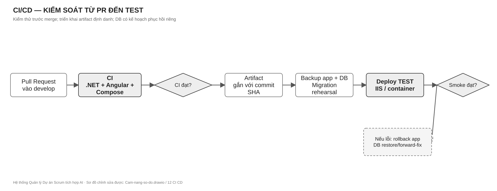

*Cách đọc Hình 17.1:* đường chính đi từ PR tới TEST; nhánh lỗi sau smoke dẫn tới rollback có kiểm soát. Tệp chỉnh sửa: `diagrams/Cam-nang-so-do.drawio`, trang `12 CI CD`.

| Môi trường | Mục đích | Dữ liệu/secret | Cổng ra |
|---|---|---|---|
| Local | Phát triển và test | Dữ liệu giả, `.env`/User Secrets | Unit + chạy flow cục bộ. |
| TEST | Tích hợp và demo | Secret ngoài repo, DB được backup | Smoke/E2E và UAT. |
| Production (nếu vận hành thật) | Người dùng thật | Secret store/ACL, TLS, backup định kỳ | Phê duyệt release, monitor, rollback. |

### 17.3 Runbook tối thiểu

**API không khởi động:** kiểm `ConnectionStrings:ProjectMgmt`, `Database:ServerVersion`, MySQL và log startup; không in connection string. **Health live xanh nhưng chức năng lỗi:** chạy readiness và một GET có quyền; kiểm migration, permission và dependency AI. **AI timeout:** dùng `generationId/runId`, xem trạng thái job, timeout, provider health và retry count; không gửi lại command không idempotent. **Board xung đột:** so version/ETag, reload dữ liệu, không ghi đè mù. **Deploy TEST lỗi:** giữ artifact/log/correlation ID, dừng traffic, phục hồi backup ứng dụng, quyết định riêng với DB migration, chạy smoke sau phục hồi. **Rò dữ liệu:** khóa quyền/token, bảo toàn log cần thiết, đánh giá phạm vi, thay secret, kiểm truy cập chéo và sửa trước khi mở lại.

## 18. Bàn giao và bảo trì kiến trúc

Người tiếp nhận dự án cần nhận: source và commit/tag phát hành; quyển cẩm nang cùng `.drawio`; OpenAPI; DDL/migration và phương án restore; danh sách secret cần cấp **không chứa giá trị secret**; artifact/model/prompt/dataset version; test report; quyền truy cập CI/runner và owner. Ngày đầu: clone, chạy test, dựng local với DB cô lập, mở Swagger, đi một hành trình từ Chương 3, xác nhận quyền của tài khoản thử. Ngày thứ hai: đọc một use case xuyên các lớp và một contract liên module, chạy test rồi mới sửa code.

Khi quyết định kiến trúc thay đổi, ghi ADR gồm: vấn đề, bối cảnh, các phương án, quyết định, hệ quả, owner, ngày áp dụng, migration/rollback. Đổi ranh giới sở hữu dữ liệu, công thức AI hoặc chính sách quyền là thay đổi kiến trúc; không chỉ sửa code rồi để tài liệu tự lỗi thời. Sơ đồ draw.io là nguồn hình gốc; tên hình, giải thích và ảnh chèn trong quyển cẩm nang phải cập nhật cùng PR.

# Phụ lục A. Danh mục hình và cách đọc

| Hình | Tên | Câu hỏi trả lời |
|---|---|---|
| 1.1 | Quy trình nghiệp vụ xuyên suốt | Người dùng và hai AI đi qua luồng nào? |
| 5.1–5.2 | Đăng nhập; vòng đời Sprint | Bảo vệ quyền và ràng buộc Sprint thế nào? |
| 6.1–6.3 | Hai AI và DataOps | AI nào làm gì; ai phê duyệt; dữ liệu học lại ra sao? |
| 8.1–8.5 | Bối cảnh, Modular Monolith, Clean Architecture, phụ thuộc, triển khai | Hệ thống ở đâu và mã được chia/triển khai thế nào? |
| 9.1, 11.1–11.4 | Sở hữu dữ liệu, ERD khái quát và 55 bảng | Module nào được ghi bảng nào; quan hệ nào là FK hay XMOD? |
| 10.1 | Tạo Issue | Các module trao đổi theo trình tự nào? |
| 13.1 | Phối hợp ba người | Ai làm gì và bàn giao ở đâu? |
| 17.1 | CI/CD | Một thay đổi đi vào TEST và phục hồi thế nào? |

Quy ước đồ họa: các sơ đồ đơn sắc, nền trắng, chữ đen/xám đậm và viền xám; độ đậm nhạt chỉ để nhấn trọng tâm. Nét liền là luồng/chuyển giao chính; nét đứt là tương tác phụ hoặc biên ngoài. Các hình là sơ đồ kỹ thuật, không phải ảnh minh họa trang trí. Bản chỉnh sửa được nằm tại `diagrams/Cam-nang-so-do.drawio` và `diagrams/ERD-55-bang.drawio`; ảnh SVG được sinh từ cùng đặc tả hình để in rõ nét.

# Phụ lục B. Nguồn tra cứu và quy tắc ưu tiên

Quyển này hợp nhất ba tài liệu đầu bài: `Hệ thống Quản lý Dự án Scrum + AI-Nhóm 7 Kỹ Sư (1).pdf`, `Phan_bo_vai_tro_module_nhom_3_nguoi.pdf`, `Mo_ta_bai_toan_va_pham_vi_du_an_v2.docx`, cùng thiết kế CSDL v3, DDL MySQL, solution, mã nguồn và workflow CI/CD trong repository. Tài liệu mô tả bài toán v2 chứa phạm vi nghiên cứu rộng hơn (nhiều mô hình ML, SQL Server, CQRS/Event Sourcing/CRDT). Quyết định sản phẩm của nhóm cho cẩm nang này là **hai AI đối diện người dùng**, **ba module lớn**, **MySQL**, **service/repository truyền thống**, **Modular Monolith + Clean Architecture**. Các đề tài nghiên cứu khác là khả năng mở rộng có điều kiện, không phải yêu cầu mặc định của sản phẩm.

Khi triển khai, thứ tự kiểm chứng là: yêu cầu sản phẩm đã được nhóm phê duyệt → hợp đồng/acceptance test → mã nguồn và migration của phiên bản phát hành → tài liệu tham khảo. Nếu triển khai sai một quy tắc trong sách, sửa triển khai hoặc trình ADR đổi quy tắc; không âm thầm đổi nghĩa tài liệu. Không dùng lịch sử chat hoặc bản nháp tài liệu cũ làm điều kiện tiên quyết cho người đọc.

# Phụ lục C. Checklist tra cứu nhanh

- Tính năng có actor, mục tiêu, quyền, invariant, dữ liệu, API, UI và test chưa?
- Module owner có duy nhất không? Consumer có đi qua Contracts thay vì DbContext chéo không?
- AI có phiên bản model/prompt/feature, kết quả nháp, bước duyệt và phản hồi không?
- Command retry có an toàn? Transaction/outbox/notification sau commit có rõ không?
- Dữ liệu cá nhân và secret có bị đưa vào log, prompt, dataset hoặc artifact không?
- Migration có backup, rehearsal, kế hoạch phục hồi và test trên MySQL cô lập không?
- Sơ đồ, OpenAPI, cẩm nang và kiểm thử có được cập nhật cùng thay đổi không?
